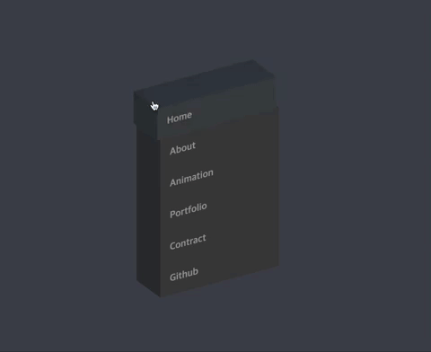

  

  # Style-Playground

인터렉티브한 UI를 만드는 놀이터 / Interactive UI Playground 
  

 

평소에 CSS에 별로 좋아하지 않아 고민이었습니다.

 

별로 좋아하지 않으면, 

 

최대한 멋있어 보이게 만들면 재밌지 않을까 하는 생각에 만든 공간입니다. 

 

실제로도 재밌어서 틈틈히 작업하고 싶지만, 

 

더 재밌는 것들이 많아 계속 뒤로 밀리는 중입니다. 

 

잊지 않고자 profile readme에 걸어놨습니다.  

 

